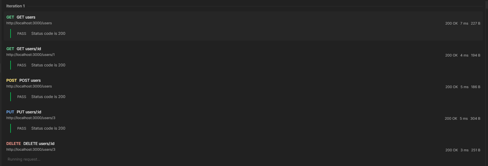

<h1 align="center">Welcome to nodejs-pure-sample 👋</h1>
<p>
  <a href="#" target="_blank">
    
  </a>
  <a href="https://twitter.com/anderson.lima.dev" target="_blank">
    
  </a>
</p>

> A simple nodejs api  without express

## Install

```sh
N/A
```

## Usage

```sh
cd src && node index.js
```

Use postman collection to test api, it's on folder tests/integrated/Nodejs - pure js sample api.postman_collection.json



## Run tests

```sh
N/A
```

## Author

👤 **anderson.lima.dev**

* Website: instagram.com/anderson.lima.dev
* Twitter: [@anderson.lima.dev](https://twitter.com/anderson.lima.dev)
* Github: [@andersonlimahw](https://github.com/andersonlimahw)
* LinkedIn: [@anderson.lima.dev](https://linkedin.com/in/anderson.lima.dev)

## Show your support

Give a ⭐️ if this project helped you!

***
_This README was generated with ❤️ by [readme-md-generator](https://github.com/kefranabg/readme-md-generator)_
